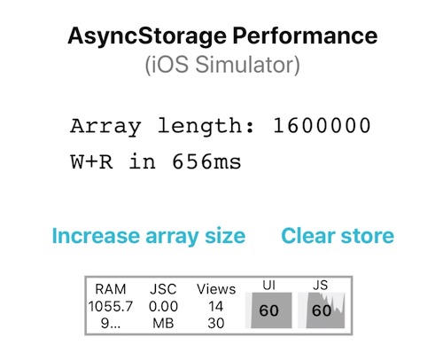

# perf-tracking-complex-components

A simple, powerful method to track the performance of complex react-native components or utils/libraries



Sometimes it is useful to check the elapsed time of a specific part of an app. The method described here, is a simple timer snippet that can be injected almost anywhere in a react-native app and, when used in combination with the simulator perf-monitor can give valuable insights into what parts of the code need to be optimised.

The App is an example that monitors the performance of the AsyncStorage community library for storing and retrieving large objects.

The full story is available .

## Prerequisites

Install node, react-native, react-native-cli

## Dependencies

See also package.json.
```
"@react-native-community/async-storage": "^1.6.1",
"react": "16.8.6",
"react-native": "0.60.4"
```

## Build

Clone this repo.
```
yarn install
yarn add @react-native-community/async-storage
cd ios && pod install
react-native run-ios or react-native run-android.
```
## Timer
```
  interval = null;
  startTime = 0;
  state = { perf: 0 }
  ...

  trackPerf = (run) => {
    if(run) {
      this.interval && clearInterval(this.interval);
      this.setState({ perf: 0 });
      this.startTime = new Date();
      this.interval = setInterval(() => {
        const elapsed = (new Date() - this.startTime) + this.state.perf;
        this.setState({ perf: elapsed, });
      }, 100);
    } else {
      this.interval && clearInterval(this.interval);
    }
  }

```

## Use (see App.js)
```
  this.trackPerf(true);
  await Store.set(this.ARRAY, storedArray, this.setError);
  const newItem = await Store.get(this.ARRAY, this.setError);
  this.trackPerf(false);
```

## Authors

* **Miguel Albrecht** - [zapalote](https://zapalote.com/)
